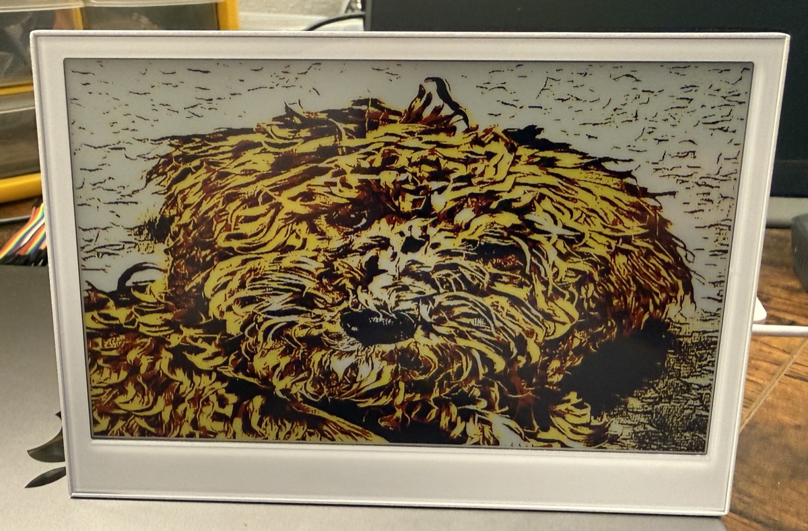

# Rust Embassy Examples for Seeed Studio reTerminal E1002

This repository contains idiomatic Rust examples for the **Seeed Studio reTerminal E1002** carrier board (powered by the **XIAO ESP32-S3** MCU), built using the [Embassy](https://embassy.dev/) async framework, `esp-hal` (v1.1), and `defmt` logging over USB-UART / RTT.

---

## Hardware Overview

- **MCU Board:** Seeed Studio XIAO ESP32-S3
  - **SoC:** ESP32-S3 (Dual-core Xtensa LX7 @ 240 MHz, Wi-Fi 4, Bluetooth 5 LE)
  - **Onboard Peripherals:** User LED, Battery ADC divider, Passive Buzzer, PCF8563 RTC, SHT40 Temp/Humidity Sensor, 3 User Buttons, microSD Card Slot.

### Common Pin Assignments

| Peripheral / Interface | Signal | GPIO Pin | Notes |
|---|---|---|---|
| **I2C Bus (I2C0)** | **SDA** | GPIO19 | Shared bus (RTC & SHT40) |
| | **SCL** | GPIO20 | Shared bus (RTC & SHT40) |
| **SPI Bus (SPI2)** | **SCK** | GPIO7 | Shared bus (microSD & ePaper Display) |
| | **MISO** | GPIO8 | Shared bus (microSD & ePaper Display) |
| | **MOSI** | GPIO9 | Shared bus (microSD & ePaper Display) |
| | **SD CS** | GPIO14 | Active-LOW Chip Select for microSD |
| | **SD Detect** | GPIO15 | Active-LOW Card Detect (`LOW` = Card Present) |
| | **SD Power Enable** | GPIO16 | Active-HIGH Load Switch (`HIGH` = Power ON) |
| **User Inputs** | **KEY0** | GPIO3 | Active-LOW User Button 0 |
| | **KEY1** | GPIO4 | Active-LOW User Button 1 |
| | **KEY2** | GPIO5 | Active-LOW User Button 2 |
| **User Outputs** | **User LED** | GPIO6 | Active-LOW Green LED (`LOW` = ON) |
| | **Buzzer** | GPIO45 | Passive Piezo Buzzer (LEDC PWM) |
| | **Battery ADC** | GPIO1 | ADC1 Channel 0 (1:2 Voltage Divider) |
| | **Battery Enable** | GPIO21 | Active-HIGH Voltage Divider Circuit Enable |
| **Serial Logging** | **UART1 TX** | GPIO43 | Connected to onboard USB-to-UART bridge |
| | **UART1 RX** | GPIO44 | Connected to onboard USB-to-UART bridge |

---

## Examples

### Power & Analog Examples

#### battery

Reads the Li-Po battery voltage through the onboard 1:2 resistor voltage divider. Drives the active-HIGH enable pin (`GPIO21`) HIGH before sampling ADC1 (`GPIO1`) and LOW afterward to avoid wasting battery current through the divider circuit.

```bash
cargo run --example battery
```

**Wiring Schematic:**

```text
            Seeed Studio reTerminal E1002 Carrier Board
          +-------------------------------------------------+
          | Li-Po Battery Connector (+)                     |
          |       |                                         |
          |       +---[ 100k Ohm ]---+                      |
          |                          |                      |
          |                 GPIO1 (ADC1 CH0)                |
          |                          |                      |
          |       +---[ 100k Ohm ]---+                      |
          |       |                                         |
          |   [ MOSFET Switch ] <--- GPIO21 (Batt Enable)   |
          |       |                                         |
          |      GND                                        |
          +-------------------------------------------------+
```

**About Battery Monitoring:**
The onboard circuit halves the battery voltage before feeding it to ADC pin GPIO1. To calculate true battery voltage:
$$V_{\text{batt}} = 2 \times V_{\text{adc}}$$

---

### Button & Input Examples

#### button

Monitors the three user buttons (`KEY0`, `KEY1`, `KEY2`) with time-based debouncing (50ms stability threshold) and logs press and release events via `defmt`.

```bash
cargo run --example button
```

**Pin Mapping:**

```text
            Seeed Studio reTerminal E1002 Carrier Board
          +-------------------------------------------------+
          | 3.3V ---[ Pull-Up ]---+                         |
          |                       |                         |
          |            GPIO3 (KEY0) / GPIO4 (KEY1) / GPIO5 (KEY2)
          |                       |                         |
          |                 [ Tactile Switch ]              |
          |                       |                         |
          |                      GND                        |
          +-------------------------------------------------+
```

---

### Audio & PWM Examples

#### buzzer

Drives the onboard passive buzzer on `GPIO45` using ESP32-S3 LEDC hardware PWM. Demonstrates an ascending 3-note startup chime, a double beep, and a low-to-high frequency alert sweep.

```bash
cargo run --example buzzer
```

#### buzzer_tone

Plays the **Imperial March** (Darth Vader theme from Star Wars) using a custom musical score player that supports regular notes, dotted notes, and rests at 120 BPM.

```bash
cargo run --example buzzer_tone
```

---

### User LED Examples

#### led

Controls the onboard user LED on `GPIO6`. Demonstrates digital blinking and smooth brightness fading using LEDC hardware PWM.

```bash
cargo run --example led
```

> **Note on Active-LOW Logic:** Driving `GPIO6` LOW (0% PWM duty) turns the LED **ON**, while driving `GPIO6` HIGH (100% PWM duty) turns the LED **OFF**.

---

### Sensors & I2C Examples

#### rtc

Reads and sets the onboard **PCF8563** Real-Time Clock over I2C (`SDA: GPIO19`, `SCL: GPIO20`). Sets initial date/time at startup and logs the current timestamp every second.

```bash
cargo run --example rtc
```

**About PCF8563:**
The PCF8563 is an ultra-low power CMOS Real-Time Clock / calendar chip from NXP with an I2C slave address of `0x51`.

#### sht4x

Reads temperature (°C) and relative humidity (%RH) from the onboard **Sensirion SHT40** sensor over I2C every 2 seconds.

```bash
cargo run --example sht4x
```

**About Sensirion SHT40:**
- **Temperature Range:** -40°C to +125°C (±0.2°C accuracy)
- **Humidity Range:** 0% to 100% RH (±1.8% RH accuracy)
- **I2C Address:** `0x44`

---

### Storage & SPI Examples

#### sd

Mounts the onboard microSD card slot over SPI2 (`SCK: GPIO7`, `MISO: GPIO8`, `MOSI: GPIO9`, `CS: GPIO14`). Enables slot power (`GPIO16`), verifies card insertion (`GPIO15`), lists root directory contents, and writes/reads `/HELLO.TXT` using the `embedded-sdmmc` crate.

```bash
cargo run --example sd
```

**Pin Mapping (SPI2 / HSPI):**

```text
     reTerminal E1002 Carrier Board          microSD Slot
   +--------------------------------+      +---------------+\
   | GPIO16 (Power Enable, HIGH) ---+----->| VDD           | |
   | GPIO15 (Card Detect, LOW)   <--+------| DET           | |
   | GPIO7  (SPI SCK)  -------------+----->| CLK           | |
   | GPIO8  (SPI MISO) <------------+------| DO            | |
   | GPIO9  (SPI MOSI) -------------+----->| DI            | |
   | GPIO14 (SD CS)    -------------+----->| CS            | |
   +--------------------------------+      +---------------+ /
```

---

### Display & E-Paper Examples

#### epd_ed2208_demo

Comprehensive 6-color e-Paper graphic demonstration for the 7.3" Good Display GDEP073E01 panel (ED2208 controller) using `epdsi` and `embedded-graphics`. Based on the GxEPD2 Demo Arduino sketch for Seeed Studio reTerminal E1002.

Sequences through 6 distinct screens rendered using `embedded-graphics` primitives, fonts, and custom color targets:
1. **Splash Screen:** Titles, subtitle banners, blue horizontal accent divider, top & bottom 6-color stripes.
2. **Color Palette:** 6 native color swatches (Black, White, Red, Green, Blue, Yellow), 5 background/foreground contrast tiles, 5 full-width horizontal color bars.
3. **Color Typography:** Multi-color large text, yellow/red highlight messages, white text on colored badge rects, dark card containing multi-color text lines.
4. **Color Geometry:** Cascading colored rectangles, filled colored circles, triangles, 5-ring Olympic circles, 2x3 swatch grid, concentric circles.
5. **Color Patterns:** 4 pattern boxes (Color Check, H-Stripes, V-Stripes, Color Dots) and a stacked color bar sequence.
6. **Dashboard:** Status metric cards (Temp, Humidity, Heap, Uptime), activity log with colored dot indicators, multi-color progress bar with 100% indicator.

```bash
cargo run --release --example epd_ed2208_demo
```

#### epd_ed2208_bmp

Displays 24-bit or 32-bit uncompressed BMP images from a microSD card on the 7.3" Good Display GDEP073E01 6-Color ACeP panel using the local `epdsi` driver library (`Ed2208Controller`).

- **Shared SPI Bus:** Shares SPI2 (`SCK: GPIO7`, `MISO: GPIO8`, `MOSI: GPIO9`) between microSD (`CS: GPIO14`) and EPD (`CS: GPIO10`, `DC: GPIO11`, `RES: GPIO12`, `BUSY: GPIO13`) via `embedded_hal_bus::spi::RefCellDevice`.
- **Nearest Color Quantization:** Quantizes image RGB pixels to the 6 native panel colors (Black, White, Yellow, Red, Blue, Green) using nearest Euclidean distance.
- **Fallback Test Pattern:** Generates a 6-color stripe test pattern if no SD card or matching BMP image is found.

```bash
cargo run --release --example epd_ed2208_bmp
```




#### Image Conversion Tool (`convert_image.py`)

A Python helper script is provided in the repository root to convert any input photo or image (JPG, PNG, WEBP, etc.) into an uncompressed 800x480 BMP formatted for the reTerminal E1002 microSD card:

```bash
# Basic conversion: resizes to 800x480 and quantizes to 6 e-ink colors
python3 convert_image.py images/mocha800x480.jpg /Volumes/SD/IMAGE.BMP

# Show on-screen preview of quantized e-ink colors
python3 convert_image.py images/mocha800x480.jpg --preview
```

Included sample images in `./images/`:
- `epd_ed2208_bmp.jpg`: Photo demonstration of the reTerminal E1002 displaying a 6-color BMP image on the 7.3" EPD panel.
- `image.bmp` / `image_preview.png`: Pre-converted 800x480 6-color sample BMP image.
- `mocha800x480.jpg` / `mocha800x480_preview.png`: Sample source photo and 6-color e-ink preview.


---

## License

Dual-licensed under either of:
- Apache License, Version 2.0 ([LICENSE-APACHE](LICENSE-APACHE) or <http://www.apache.org/licenses/LICENSE-2.0>)
- MIT license ([LICENSE-MIT](LICENSE-MIT) or <http://opensource.org/licenses/MIT>)
at your option.
